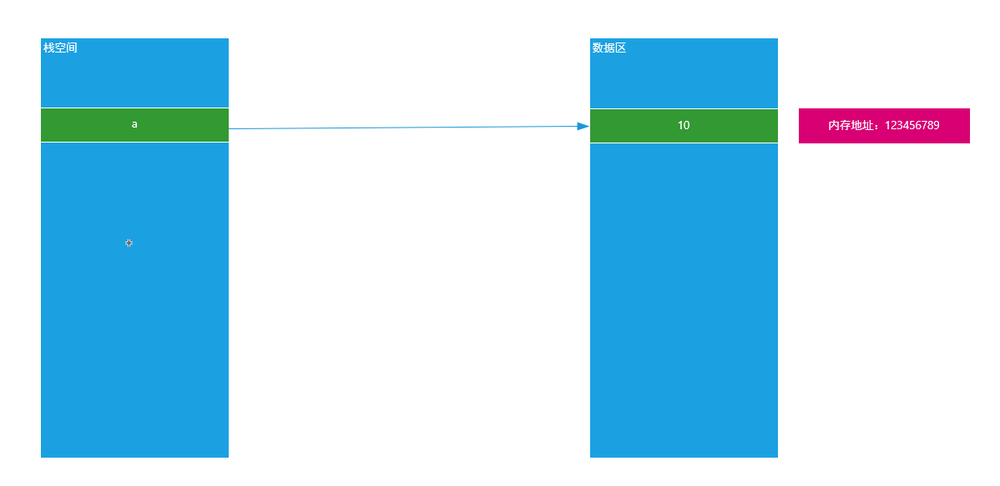
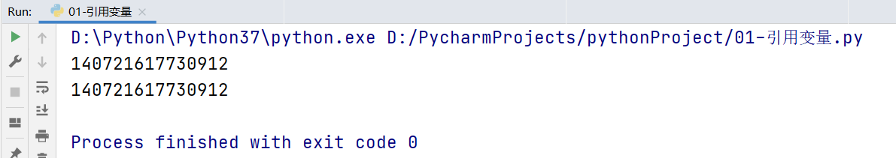
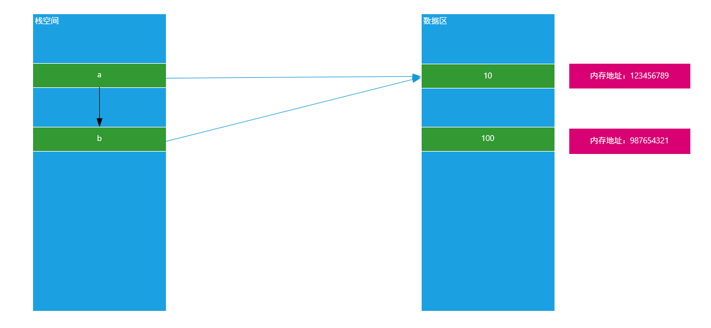
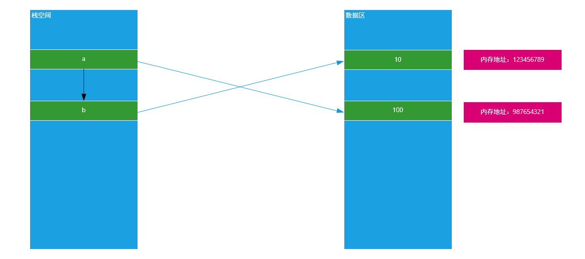
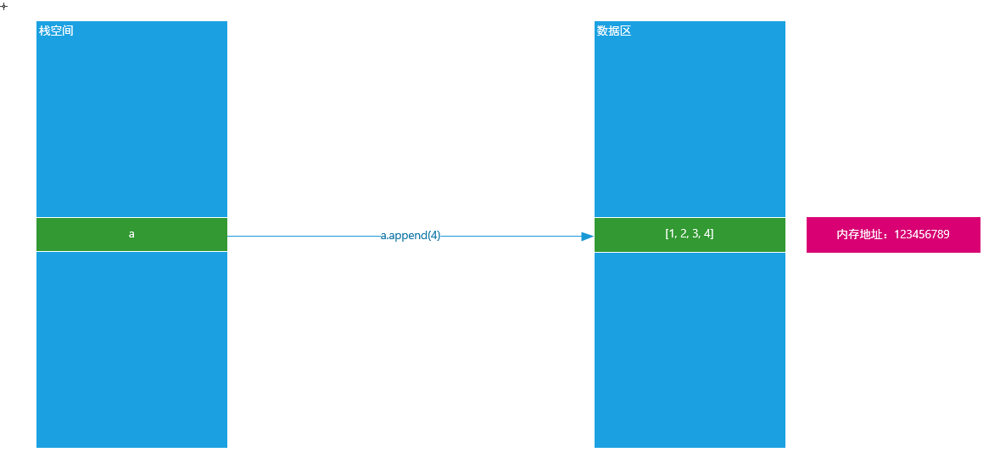
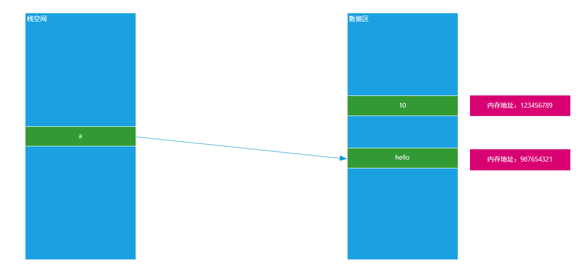
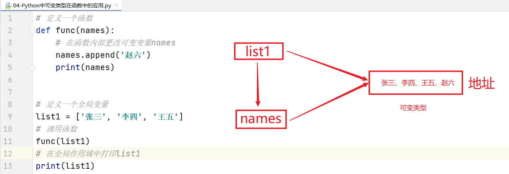
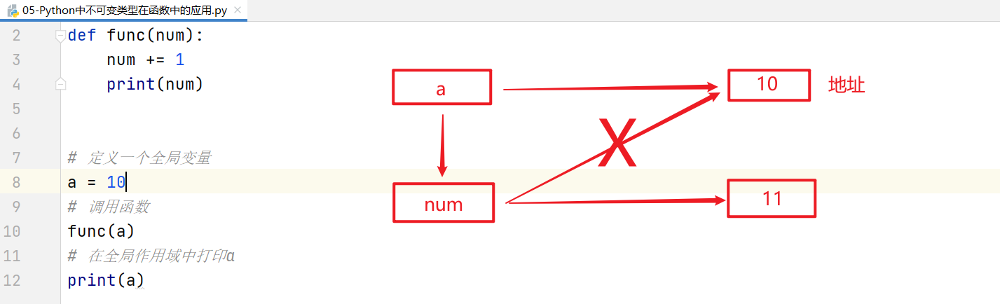
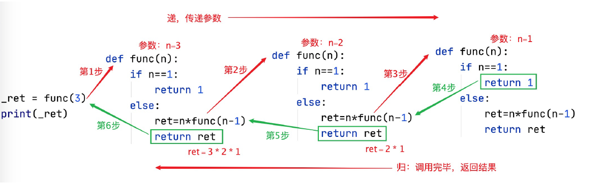

# Python函数进阶

# 一、常见问题汇总

## 1、格式化输出与%百分号

以下结果中，可以正常输出“50%及格”语句是（B）

A、print("%d\%及格" % (50))    =>  回答大部分结果（Python这种写法不正确）

==B、print("%d%%及格" % (50))  =>  正确结果==

## 2、字符串切片

定义一个字符串str1 = 'abcdefg'，使用切片截取字符串str1[3::-2]，求返回结果：（C）

C、'db'

> 只顾头来尾不管，步长为正则正向移动（从左向右），步长为负，则逆向移动（从右向左）

## 3、字典的定义

其实字典中的key可以是很多数据类型（不可变数据类型 => 整型、浮点型、字符串、元组）

```python
my_dict = {}
my_dict[1] = 1
my_dict['1'] = 2
my_dict[1.0] = 3
print(my_dict[1] + my_dict['1'] + my_dict[1.0]) # 8
# 注：在字典中，如果key是数字类型，如果两个值相等，则后面这个key会替换前面这个key的value值
```

## 4、企业面试题

对于一个函数num，当调用num(1,2,a=3,b=4)和调用num(3,4,5,6,a=1)以及num(a=1,b=2)的时候都可以正常运行，并且可以对元组以及字典类型进行遍历输出，对字典类型进行输出字典的键值对(形式为：key：a，value：1)，请写出这个函数并完成调用。

函数调用时，参数不固定，另外传递的参数的类型（不定长位置参数和不定长关键词参数）

```python
def num(*args, **kwargs):
    for i in args:
        print(i)
    for key,value in kwargs.items():
        print("key:",key,"value:",value)
num(1,2,3,a=1, b=2)
# num(a=1, b=2)  此种情况也可
```

# 二、引用变量与可变、非可变类型

## 1、引用变量

在大多数编程语言中，值的传递通常可以分为两种形式“值传递与引用传递”，但是在Python中变量的传递基本上都是引用传递。

### ☆ 聊聊变量在内存底层的存储形式

```python
a = 10
```

第一步：首先在计算机内存中创建一个数值10（占用一块内存空间）

第二步：在栈空间中声明一个变量，如a

第三步：把数值10的内存地址赋予给变量小a，形成所谓的==“引用关系”==



### ☆ 如何验证Python中变量的引用关系

答：可以使用内置方法id()，其参数就是要显示的变量信息 => `id(变量名称)`

```python
a = 10
print(id(a))
```

### ☆ 把一个变量赋予给另外一个变量的影响

```python
a = 10
b = a
print(id(a))
print(id(b))
```

运行结果：



说明：由以上运行结果可知，当我们把一个变量赋予给另外一个变量时，其两者指向的内存地址相同。就说明a和b指向了同一块内存空间，原理图如下：



思考：如果在b = a以后，我们改变了变量a的值，问变量b是否会受到影响？

```python
# a = 10
# print(id(a))

a = 10
b = a

a = 100
print(b)  # 10 或 100

print(id(a))
print(id(b))
```

原理图：



总结：不可变数据类型（数值）在赋值以后，其中一个值的改变不影响另外一个变量，因为两者指向空间地址不同。

## 2、Python中可变和非可变数据类型

### ☆ 问题1：在Python中一共有几种数据类型？

答：7种，数值（int整型、float浮点类型）、bool类型（True和False）、字符串类型（str）、元组（tuple 1,2,3）、列表（list [1, 2, 3]）、字典（dict {key:value})、集合（set {1, 2})

在Python中，我们可以把7种数据类型分为两大类：可变类型 + 非可变类型

① 非可变类型

数值（int整型、float浮点类型）

bool类型（True和False）

字符串类型（str）

元组（tuple 1,2,3）


② 可变类型

列表（list [1, 2, 3]）

字典（dict {key:value})

集合（set {1, 2})

### ☆ 问题2：如何判断一个数据类型是可变类型还是非可变类型？

在Python中，可变类型与非可变类型主要是通过这个数据类型在内存中的表现形式来进行定义的。

==① 可变类型就是在内存中，其内存地址一旦固定，其变量的值是可以发生改变的==

```python
a = [1, 2, 3]
print(id(a))

# 向内存中追加新数据（对数据进行改变只能通过数据类型.方法()实现）
a.append(4)
print(id(a))
```

原理图：



==② 非可变类型就是在内存中，内存地址一旦固定，其变量的值就没办法发生任何改变了==

```python
a = 10
print(id(a))

a = 'hello'
print(id(a))
```

原理图：



## 3、可变类型与非可变类型在函数中的应用

### ☆ 可变类型

```python
# 定义一个函数
def func(names):
    names.append('赵六')
    
# 定义一个全局变量
names = ['张三', '李四', '王五']
# 调用函数
func(names)

print(names)  # ???
```

原理图：



综上所述：可变类型在函数中，如果在全局或局部中对可变类型进行增删改操作，其外部和内部都会受到影响。

### ☆ 不可变类型

```python
# 定义一个函数
def func(num):
    num += 1
    print(num)
    
# 定义一个全局变量
a = 10
# 调用函数
func(a)
# 在全局作用域中打印a
print(a)
```



综上所述：不可变类型在函数中，局部或全局的改变对外部和内部都没有任何影响。

# 三、函数递归（重点难点）

## 1、前言

编程思想：如何利用数学模型，来解决对应的需求问题；然后利用代码实现对应的数据模

算法：使用代码实现对应的数学模型，从而解决对应的业务问题

> 程序 = 算法 + 数据结构

在我们经常使用的算法中，有两种非常常用的算法：`递推算法 + 递归算法`，专门用于解决一些比较复杂，但是拆分后相似度又非常高的程序。

## 2、递推算法

递推算法：递推算法是一种简单的算法，即通过已知条件，利用特定条件得出中间推论，直至得到结果的算法。递推又分为顺推和逆推。

顺推：通过最简单的条件，然后逐步推演结果

逆推：通过结果找到规律，然后推导已知条件


递推算法案例：斐波那契数列

1    1    2    3    5    8    13    21   ...

① ② ③  ④  ⑤  ⑥ ...

第1位为1，第2位为1，第3位为2 = 1 + 1，第4位为3 = 2 + 1，依次类推...第n位结果为多少？

f(n) = f(n-1) + f(n-2)

提出问题：求斐波那契数列第15位的结果？

分析：f(15) = f(14) + f(13)  

​            f(14) = f(13) + f(12)

​	        f(13) = f(12) + f(11)

​            ...

​		    f(4)   =  f(3) + f(2)   = 3  +  1

​		    f(3)   =  f(2) + f(1)   = 2

​	        f(2)  =   1

​           f(1)   =   1

递推算法：使用while循环或for循环

```python
# 递推算法：根据已知条件，求结果（或者根据结果求未知条件）
def recusive(n):
    """ 返回斐波那契数列某一位（n>=1）的结果 """
    if n == 1 or n == 2:
        return 1
    # 开始递推f(3) = f(2) + f(1)  f(4) = f(3) + f(2) ... f(15) = f(14) + f(13)
    dict1 = {1:1, 2:1}
    for i in range(3, n+1):
        # f(3) = f(2) + f(1)
        # f(i) = f(i-1) + f(i-2)
        dict1[i] = dict1[i-1] + dict1[i-2]
    return dict1[n]

# 函数调用
print(recusive(15))
```

## 3、什么是递归算法

程序调用自身的编程技巧称为递归（ recursion）。递归做为一种算法在程序设计语言中广泛应用，它通常==把一个大型复杂的问题层层转化为一个与原问题相似的规模较小的问题来求解==，递归策略只需少量的程序就可描述出解题过程所需要的多次重复计算，大大地减少了程序的代码量。

① 简化问题：找到最优子问题（不能再小） ② 函数自己调用自己

```python
def func():
    # 自己调用自己
    func()
    
func()
```

## 4、递归两种重要的元素

递归有两个非常重要的概念：

==① 递归点==：找到解决当前问题的等价函数（先解决规模比当前问题小一些的函数，依次类推，最终实现对问题的解决） => 有递有归

==② 递归出口==：当问题解决的时候，已经到达（必须存在）最优问题，不能再次调用函数了

> 注：如果一个递归函数没有递归出口就变成了死循环

## 5、编写递归三步走

==① 明确你这个函数想要干什么==

如：求斐波那契数列

==② 寻找递归结束条件==

如：就是在什么情况下，递归会停止循环，返回结果

==③ 找出函数的等价关系式==

如：斐波那契数列，第n位 f(n) = f(n-1) + f(n-2)


案例1：使用递归求斐波那契数列

第一步：明确这个函数想要干什么（先定义出来，明确调用方式）

```python
# 斐波那契数列 1 1 2 3 5 8 13 21 ...
def f(n):
    # 编写递归代码求第n位的结果

# 调用函数
print(f(15))  # 610
```

第二步：寻找递归的结束条件

```python
# 斐波那契数列 1 1 2 3 5 8 13 21 ...
def f(n):
    # 编写递归代码求第n位的结果
    if n == 1 or n == 2:
        return 1

# 调用函数
print(f(15))  # 610
```

第三步：找出函数的等价关系式(最关键的一步)

```python
# 斐波那契数列 1 1 2 3 5 8 13 21 ...
def f(n):
    # 编写递归代码求第n位的结果
    if n == 1 or n == 2:
        return 1
    # 找出与斐波那契数列等价的关系式
    return f(n-1) + f(n-2)

# 调用函数
print(f(15))  # 610
```

案例2：使用递归求N的阶乘（如n=50）

阶乘是什么？一个正整数的阶乘（factorial）是所有小于及等于该数的正整数的积，如：n!=1×2×3×...×(n-1)×n

1! = 1

2! = 1x2 = 2

3! = 1x2x3 = 6

4! = 1x2x3x4 = 24

...

n!=1×2×3×...×(n-1)×n

第一步：明确这个函数要做什么以及定义函数以及调用方式

```python
def f(n):
    # 编写递归条件
    
print(f(100))
```

第二步：寻找递归的结束条件

```python
def f(n):
    # 编写递归结束条件
    if n <= 2:
        return n
    # ...递归等式
print(f(100))
```

第三步：编写递归等价公式（自己要调用自己）

等价公式 = 找规律

1! = f(1) = 1

2! = f(2) = 2

3! = f(2)x3 = 6

4! = f(3)x4 = 24

...

n!= f(n-1) * n

```python
def func(n):
    # 编写递归结束条件
    if n <= 2:
        return n
    # ...递归等式
    return func(n-1) * n
print(func(100))
```

递归函数执行流程：



案例3：面试题 => 猴子吃桃问题

猴子吃桃问题。猴子第1天摘下若干个桃子，当即吃了一半，还不过瘾，又多吃了一个。第2天早上又将剩下的桃子吃掉一半，又多吃了一个。以后每天早上都吃了前一天剩下的一半另加一个。到第10天早上想再吃时，就只剩下一个桃子了。求第1天共摘了多少个桃子

第一步：确定函数主要要完成什么功能，需要传递哪些参数，确认调用方式

```python
def f(n):
    # 编写递归代码
    
# 调用f函数
print(f(1))
```

第二步：编写递归的结束条件（出口）

```python
# 第一步：确定函数功能
def f(n):
    # 第二步：编写递归结束条件（出口）
    if n == 10:
        return 1

# 调用函数
print(f(1))
```

第三步：找出与这个问题相等的等式关系

求桃子的剩余数量？

假设法：假设第9天有n个桃子

第n天，总剩余桃子的数量 = （第(n+1)天桃子的剩余桃子的数量 + 1) * 2

```python
# 第一步：确定函数功能
def f(n):
    # 第二步：编写递归结束条件（出口）
    if n == 10:
        return 1
    # 第三步：寻找与这个问题相似的等价公式
    return (f(n+1) + 1) * 2

# 调用函数
print(f(1))
```

# 四、lambda表达式

## 1、普通函数与匿名函数

在Python中，函数是一个被命名的、独立的完成特定功能的一段代码，并可能给调用它的程序一个返回值。

所以在Python中，函数大多数是有名函数 => 普通函数。但是有些情况下，我们为了简化程序代码，也可以定义匿名函数 => lambda表达式

## 2、lambda表达式应用场景

如果一个函数有一个返回值，并且只有一句代码，可以使用 lambda简化。

## 3、lambda表达式基本语法

```python
变量 = lambda 函数参数:表达式（函数代码 + return返回值）
# 调用变量
变量()
```

## 4、编写lambda表达式

定义一个函数，经过一系列操作，最终返回100

```python
def fn1():
    return 100

# 调用fn1函数
print(fn1)  # 返回fn1函数在内存中的地址
print(fn1())  # 代表找到fn1函数的地址并立即执行
```


lambda表达式进行简化：

```python
fn2 = lambda : 100

print(fn2)  # 返回fn2在内存中的地址
print(fn2())
```

## 5、编写带参数的lambda表达式

编写一个函数求两个数的和

```python
def fn1(num1, num2):
    return num1 + num2

print(fn1(10, 20))
```

lambda表达式进行简化：

```python
fn2 = lambda num1, num2:num1 + num2

print(fn2(10, 20))
```

## 6、lambda表达式相关应用

### ☆ 带默认参数的lambda表达式

```python
fn = lambda a, b, c=100 : a + b + c
print(fn(10, 20))
```

### ☆  不定长参数：可变参数*args

````python
fn1 = lambda *args : args

print(fn1(10, 20, 30))
````

### ☆ 不定长参数：可变参数**kwargs

```python
fn2 = lambda **kwargs : kwargs

print(fn2(name='Tom', age=20, address='北京市海淀区'))
```

### ☆ 带if判断（三目运算符）的lambda表达式

```python
fn = lambda a, b : a if a > b else b

print(fn(10, 20))
```

### ☆ 列表数据+字典数据排序（重点）

知识点：列表.sort(key=排序的key索引, reverse=True)

```python
students = [
    {'name': 'Tom', 'age': 20},
    {'name': 'Rose', 'age': 19},
    {'name': 'Jack', 'age': 22}
]

# 按name值升序排列
students.sort(key=lambda x: x['name'])  # Jack/Rose/Tom
print(students)

# 按name值降序排列
students.sort(key=lambda x: x['name'], reverse=True)
print(students)

# 按age值升序排列
students.sort(key=lambda x: x['age'])
print(students)
```

执行流程：

```python
students = [
    {'name': 'Tom', 'age': 20},
    {'name': 'Rose', 'age': 19},
    {'name': 'Jack', 'age': 22}
]

# 按name值升序排列
students.sort(key=lambda x:x['name'])
print(students)
```

