# Python飞机大战

# 学习目标

- 飞机大战-案例简介
- pygame安装
- 飞机大战-基本步骤
- 飞机大战-代码实现
  - 创建一个游戏窗口
  - 向窗口贴背景图片
  - 在背景的基础上再贴英雄飞机图片
  - 飞机移动并发射子弹
  - 在背景的基础上再贴敌人飞机图片
  - 飞机爆炸效果

# 一、飞机大战游戏概述

## 1、案例简介

《经典飞机大战》是腾讯交流软件微信5.0版本在2013年8月推出的软件内置经典小游戏, 一经推出就在当时火爆整个朋友圈, 成为一个现象级的国民小游戏. 那么今天我们就一起使用pygame这个模块来实现一下这个小游戏。

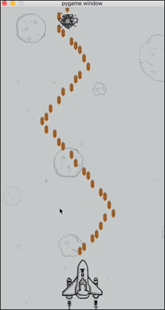

## 2、pygame介绍

pygame 是一组用来开发游戏软件的 Python 程序模块，基于 SDL 库的基础上开发。允许你在 Python 程序中创建功能丰富的游戏和多媒体程序，pygame 是一个高可移植性的模块可以支持多个操作系统。


## 3、pygame安装

pygame是python的一个专门开发游戏的模块, 下面我们看一下如何安装这个模块。

### ☆ 安装方式1：(pycharm安装)

① 选择File->Settings

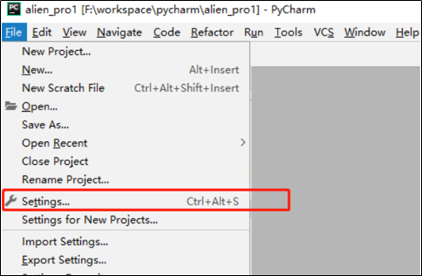

② 选择对应项目的Project Interpreter，选择pygame（可以输入pygame进行搜索，

节省时间） 

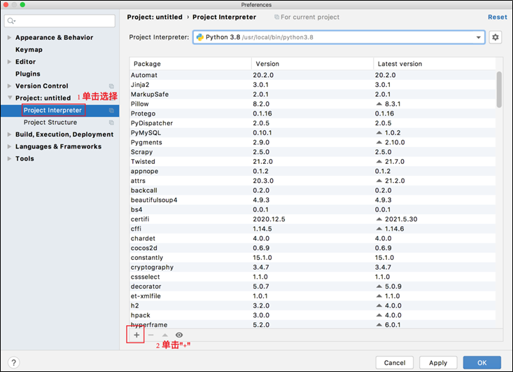

③ install package按钮，等待项目安装pygame 包完成（可能需要几分钟到十几分钟），返回后如果有pygame package信息，则说明项目配置成功

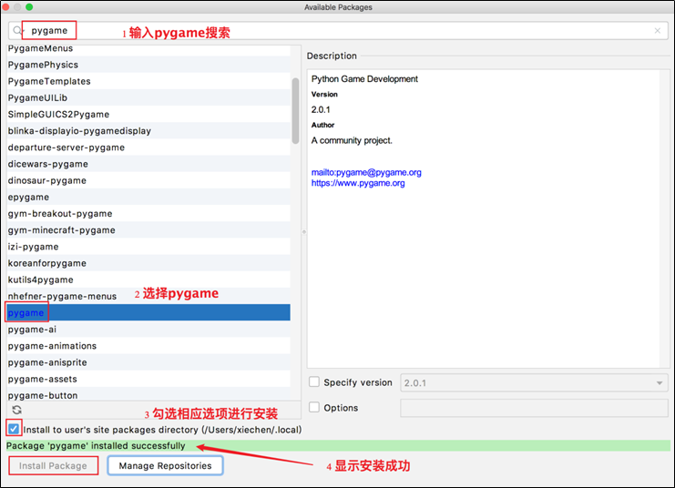

### ☆ 安装方式2：(终端安装)

① 按 windows键 + r键 打开运行框, 在运行框中输入cmd 回车，打开终端

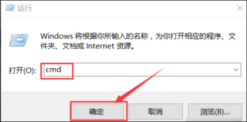

② 终端输入命令 pip3 install pygame 或者 pip install pygame 回车安装(需要联网)

Windows：

```powershell
# pip install pygame
```

Mac：

```powershell
# pip3 install pygame
```

③ 安装成功

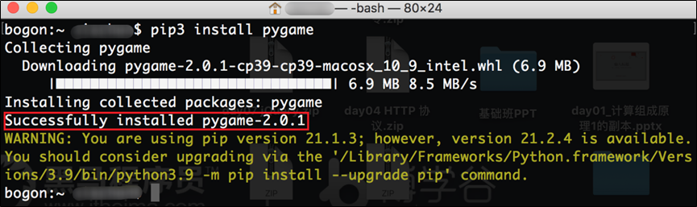

# 二、飞机大战基本步骤

## 1、游戏基本原理

大家可以看到游戏中主角连贯的出招动作、华丽的场景、震撼的战斗效果，这一切似乎很难让人想象程序是怎么实现的实际上你可以认为游戏就是根据玩家的操作来播放的动画。

假设有两张图, 一张图A作为背景, 一张图B作为游戏人物. 图A作为背景不变, 而图B会不停的变换, 当变换的速度足够快, 人类的眼睛就无法捕捉到切换的过程, 进而认为这是一个连续的整体。

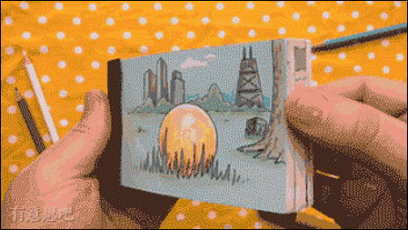

## 2、飞机大战步骤

飞机大战也是利用上述的原理

- 飞机大战的步骤
- 创建一个游戏窗口
- 向窗口贴背景图片
- 在背景的基础上再贴英雄飞机图片
- 飞机移动并发射子弹
- 在背景的基础上再贴敌人飞机图片
- 在背景的基础上贴飞机爆炸的图片就形成了飞机爆炸的效果

## 3、创建游戏窗口

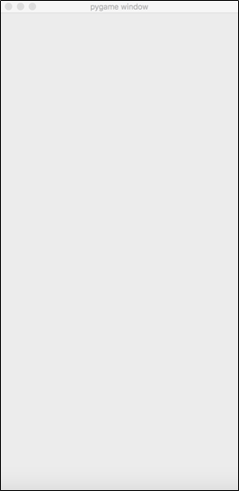

## 4、向窗口贴背景图片

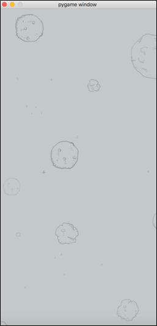

## 5、在背景的基础上再贴英雄飞机图片

screen窗口 => 粘贴飞机图片  screen.blit(飞机图片变量, (0， 0))

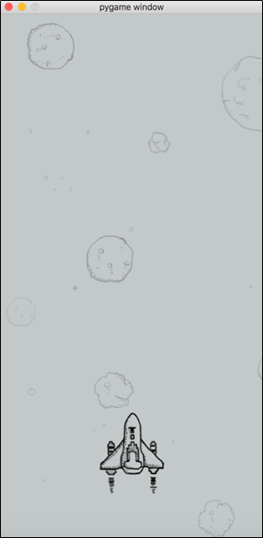

## 6、飞机移动并发射子弹

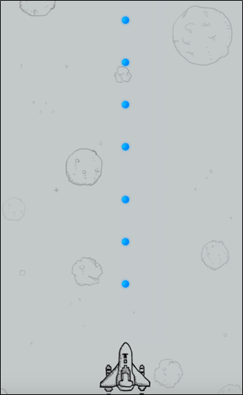

PS：这里的飞机移动其实不过是把英雄飞机的图片贴的位置进行了修改。飞机一开始在中间位置, 当我们按下左移动按键, 那么就把英雄飞机图片向左贴就可以造成飞机左移动的效果。

## 7、在背景的基础上再贴敌人飞机图片


## 8、爆炸效果


# 三、飞机大战代码实现

## 1、创建游戏窗口

这里创建游戏窗口, 我们可以认为是拿了一块画布, 这块画布上我们可以添加不同的图片(背景, 敌人飞机, 英雄飞机等)。

```python
def main(): 
    """函数功能: 流程控制函数""" 
    # 使用display方法创建一个游戏窗口 
    # display方法: 展示相关的都会用到这个方法 
    # 参数1:元组(长,高)像素 
    # 参数2:没有特殊功能 
    # 参数3:像素深度 
    screen = pygame.display.set_mode((400, 800),0,32) 
    # 加载游戏图片 
    # image方法 
    # 参数: 图片的路径 
    background = pygame.image.load("./feiji/background.png") 
    # 把加载的这个图片添加到游戏窗口上 
    # blit方法 剪切,粘贴 
    # 参数1: 粘贴的图片 
    # 参数2: 粘贴的位置 
    screen.blit(background,(0,0)) 
    # 数据更新 
    pygame.display.update() 
    # mac电脑需要设置一下 
    pygame.event.get() 
    # 阻塞10秒钟,可以让我们看到效果 
    time.sleep(10)
```

## 2、创建英雄飞机

```python
import pygame
import time

def hero_plane(screen, hero):
    # 显示英雄飞机
    screen.blit(hero,(150,600))


def main():
    """流程控制函数"""
    # 1 创建一个游戏窗口
    # display方法: 展示相关的都会用到这个方法
    # 参数1:元组(长,高)像素
    # 参数2:没有特殊功能
    # 参数3:像素深度
    screen = pygame.display.set_mode((400, 800),0,32)

    # 加载背景图片 image
    background = pygame.image.load("./feiji/background.png")

    # 加载飞机图片
    hero = pygame.image.load("./feiji/hero1.png")

    # 把这个图片添加到窗口上
    # blit 剪切,粘贴
    screen.blit(background,(0,0))

    # 显示英雄飞机
    hero_plane(screen,hero)

    # 数据更新
    pygame.display.update()

    # mac需要这只一下
    pygame.event.get()

    # 阻塞10秒钟
    time.sleep(10)


    # 2 向窗口贴背景

    # 3 英雄飞机

    # 4 敌人飞机


main()
```

通过加载背景, 会发现实际上如果想要让游戏窗口上有游戏人物(比如英雄飞机, 敌人飞机), 就是简单的把图片加载一下就可以了

## 3、英雄飞机移动

想要让飞机移动, 我们需要使用键盘进行按键操作, 那么就需要我们的程序能够检测到键盘到底按键是什么, 比如w飞机就向上移动, s飞机就向下移动。

```python
import pygame
import time
from pygame.locals import *

hero_x = 150
hero_y = 600

def hero_plane(screen, hero):
    global hero_x
    global hero_y
    # 显示英雄飞机
    screen.blit(hero,(hero_x, hero_y))
    # 按键为 左 向左贴图片 按键为右 向右贴图片
    # 事件捕获 捕获事件放在一个列表中
    for event in pygame.event.get():
        # 关闭游戏了
        if event.type == QUIT:
            # 直接退出游戏
            exit()
        # 键盘按键
        elif event.type == KEYDOWN:
            # 右方向键
            if event.key == K_RIGHT:
                hero_x += 10
            elif event.key == K_LEFT:
                hero_x -= 10
            elif event.key == K_DOWN:
                hero_y += 10
            elif event.key == K_UP:
                hero_y -= 10
            elif event.key == K_SPACE:
                print("发射子弹")

def main():
    """流程控制函数"""
    # 1 创建一个游戏窗口
    # display方法: 展示相关的都会用到这个方法
    # 参数1:元组(长,高)像素
    # 参数2:没有特殊功能
    # 参数3:像素深度
    screen = pygame.display.set_mode((400, 800),0,32)

    # 加载背景图片 image
    background = pygame.image.load("./feiji/background.png")

    # 加载飞机图片
    hero = pygame.image.load("./feiji/hero1.png")

    while True:
        # 把这个图片添加到窗口上
        # blit 剪切,粘贴
        screen.blit(background,(0,0))

        # 显示英雄飞机
        hero_plane(screen,hero)

        # 数据更新
        pygame.display.update()

        # 阻塞10秒钟
        time.sleep(0.1)


    # 2 向窗口贴背景

    # 3 英雄飞机

    # 4 敌人飞机


main()
```

## 4、飞机发射子弹

```python
import pygame
import time
from pygame.locals import *

hero_x = 150
hero_y = 600
# 子弹夹
my_bullet = []


def hero_plane(screen, hero, bullet):
    global hero_x
    global hero_y
    global my_bullet
    # 显示英雄飞机
    screen.blit(hero, (hero_x, hero_y))
    # 事件捕获 捕获事件放在一个列表中
    for event in pygame.event.get():
        # 关闭游戏了
        if event.type == QUIT:
            # 直接退出游戏
            exit()
        # 键盘按键
        elif event.type == KEYDOWN:
            # 右方向键
            if event.key == K_RIGHT:
                hero_x += 10
            elif event.key == K_LEFT:
                hero_x -= 10
            elif event.key == K_DOWN:
                hero_y += 10
            elif event.key == K_UP:
                hero_y -= 10
            elif event.key == K_SPACE:
                print("发射子弹")
                my_bullet.append({"x": hero_x + 32, "y": hero_y - 40})
    for i in my_bullet:
        # i ==> {"x":hero_x+40,"y":hero_y-20}
        screen.blit(bullet, (i["x"], i["y"]))
        screen.blit(bullet, (i["x"] + 20, i["y"]))
        screen.blit(bullet, (i["x"] - 20, i["y"]))
        # 子弹就可以自己向上跑了
        i["y"] -= 50


def main():
    """流程控制函数"""
    # 1 创建一个游戏窗口
    # display方法: 展示相关的都会用到这个方法
    # 参数1:元组(长,高)像素
    # 参数2:没有特殊功能
    # 参数3:像素深度
    screen = pygame.display.set_mode((400, 800), 0, 32)

    # 加载背景图片 image
    background = pygame.image.load("./feiji/background.png")

    # 加载飞机图片
    hero = pygame.image.load("./feiji/hero1.png")

    # 加载子弹的图片
    bullet = pygame.image.load("./feiji/plane.png")

    while True:
        # 把这个图片添加到窗口上
        # blit 剪切,粘贴
        screen.blit(background, (0, 0))

        # 显示英雄飞机
        hero_plane(screen, hero, bullet)

        # 数据更新
        pygame.display.update()

        # 阻塞10秒钟
        time.sleep(0.1)

    # 2 向窗口贴背景

    # 3 英雄飞机

    # 4 敌人飞机


main()
```

## 5、创建敌人飞机

```python
import pygame
import time
from pygame.locals import *

hero_x = 150
hero_y = 600
# 子弹夹
my_bullet = []

enemy_x = 130
enemy_path = "right"

def hero_plane(screen, hero, bullet):
    global hero_x
    global hero_y
    global my_bullet
    # 显示英雄飞机
    screen.blit(hero,(hero_x, hero_y))
    # 事件捕获 捕获事件放在一个列表中
    for event in pygame.event.get():
        # 关闭游戏了
        if event.type == QUIT:
            # 直接退出游戏
            exit()
        # 键盘按键
        elif event.type == KEYDOWN:
            # 右方向键
            if event.key == K_RIGHT:
                hero_x += 10
            elif event.key == K_LEFT:
                hero_x -= 10
            elif event.key == K_DOWN:
                hero_y += 10
            elif event.key == K_UP:
                hero_y -= 10
            elif event.key == K_SPACE:
                print("发射子弹")
                my_bullet.append({"x":hero_x+40,"y":hero_y-20})
    for i in my_bullet:
        # i ==> {"x":hero_x+40,"y":hero_y-20}
        screen.blit(bullet,(i["x"], i["y"]))
        screen.blit(bullet, (i["x"]+ 20, i["y"]))
        screen.blit(bullet, (i["x"] - 20, i["y"]))
        # 子弹就可以自己向上跑了
        i["y"] -= 50

def enemy_plane(screen, enemy):
    global enemy_x
    global enemy_path

    screen.blit(enemy,(enemy_x,10))

    if enemy_x >= 250:
        enemy_path = "left"
    elif enemy_x <= 0:
        enemy_path = "right"

    if enemy_path == "right":
        enemy_x += 10
    elif enemy_path == "left":
        enemy_x -= 10

def main():
    """流程控制函数"""
    # 1 创建一个游戏窗口
    # display方法: 展示相关的都会用到这个方法
    # 参数1:元组(长,高)像素
    # 参数2:没有特殊功能
    # 参数3:像素深度
    screen = pygame.display.set_mode((400, 800),0,32)
    # 加载背景图片 image
    background = pygame.image.load("./feiji/background.png")
    # 加载英雄飞机图片
    hero = pygame.image.load("./feiji/hero1.png")
    # 加载英雄子弹的图片
    bullet = pygame.image.load("./feiji/plane.png")
    # 加载敌人飞机图片
    enemy = pygame.image.load("./feiji/enemy2.png")

    while True:
        # 把这个图片添加到窗口上
        # blit 剪切,粘贴
        screen.blit(background,(0,0))

        # 显示英雄飞机
        hero_plane(screen,hero,bullet)

        # 显示敌人飞机
        enemy_plane(screen,enemy)

        # 数据更新
        pygame.display.update()

        # 阻塞10秒钟
        time.sleep(0.1)


    # 2 向窗口贴背景

    # 3 英雄飞机

    # 4 敌人飞机


main()
```

## 6、敌人飞机爆炸

实际上敌人飞机爆炸, 就是把敌人飞机爆炸的图片进行依次的播放

```python
import pygame
import time
from pygame.locals import *

hero_x = 150
hero_y = 600
# 子弹夹
my_bullet = []

enemy_x = 130
enemy_path = "right"
a = pygame.image.load("./feiji/enemy2_down1.png")
b = pygame.image.load("./feiji/enemy2_down2.png")
c = pygame.image.load("./feiji/enemy2_down3.png")
d = pygame.image.load("./feiji/enemy2_down4.png")
e = pygame.image.load("./feiji/enemy2_down5.png")
f = pygame.image.load("./feiji/enemy2_down6.png")
blow_up = [a,b,c,d,e,f]
enemy_num = 0
enemy_life = "live"


def hero_plane(screen, hero, bullet):
    global hero_x
    global hero_y
    global my_bullet
    # 显示英雄飞机
    screen.blit(hero,(hero_x, hero_y))
    # 事件捕获 捕获事件放在一个列表中
    for event in pygame.event.get():
        # 关闭游戏了
        if event.type == QUIT:
            # 直接退出游戏
            exit()
        # 键盘按键
        elif event.type == KEYDOWN:
            # 右方向键
            if event.key == K_RIGHT:
                hero_x += 10
            elif event.key == K_LEFT:
                hero_x -= 10
            elif event.key == K_DOWN:
                hero_y += 10
            elif event.key == K_UP:
                hero_y -= 10
            elif event.key == K_SPACE:
                print("发射子弹")
                my_bullet.append({"x":hero_x+32,"y":hero_y-40})
    for i in my_bullet:
        # i ==> {"x":hero_x+40,"y":hero_y-20}
        screen.blit(bullet,(i["x"], i["y"]))
        # screen.blit(bullet, (i["x"]+ 20, i["y"]))
        # screen.blit(bullet, (i["x"] - 20, i["y"]))
        # 子弹就可以自己向上跑了
        i["y"] -= 40

def enemy_plane(screen, enemy):
    global enemy_x
    global enemy_path
    global enemy_num
    global enemy_life
    # 子弹碰到了敌人的时候敌人就死了
    # bullet ==> {"x":hero_x+40,"y":hero_y-20}
    for bullet in my_bullet:
        if (bullet["x"] >= enemy_x and bullet["x"] <= enemy_x + 165) \
                and (bullet["y"] >= 0 and bullet["y"] <= 265):
            enemy_life = "dead"
    if enemy_life == "live":
        # 敌人飞机存活的时候
        screen.blit(enemy, (enemy_x, 10))

        if enemy_x >= 250:
            enemy_path = "left"
        elif enemy_x <= 0:
            enemy_path = "right"

        if enemy_path == "right":
            enemy_x += 10
        elif enemy_path == "left":
            enemy_x -= 10
    elif enemy_life == "dead":
        # 敌人飞机死了
        if enemy_num <= 5:
            screen.blit(blow_up[enemy_num], (enemy_x, 10))
            enemy_num += 1

        return


def main():
    """流程控制函数"""
    # 1 创建一个游戏窗口
    # display方法: 展示相关的都会用到这个方法
    # 参数1:元组(长,高)像素
    # 参数2:没有特殊功能
    # 参数3:像素深度
    screen = pygame.display.set_mode((400, 800),0,32)
    # 加载背景图片 image
    background = pygame.image.load("./feiji/background.png")
    # 加载英雄飞机图片
    hero = pygame.image.load("./feiji/hero1.png")
    # 加载英雄子弹的图片
    bullet = pygame.image.load("./feiji/plane.png")
    # 加载敌人飞机图片
    enemy = pygame.image.load("./feiji/enemy2.png")

    while True:
        # 把这个图片添加到窗口上
        # blit 剪切,粘贴
        screen.blit(background, (0, 0))

        # 显示英雄飞机
        hero_plane(screen,hero,bullet)

        # 显示敌人飞机
        enemy_plane(screen,enemy)

        # 数据更新
        pygame.display.update()

        # 阻塞0.1秒钟
        time.sleep(0.1)


main()

```

